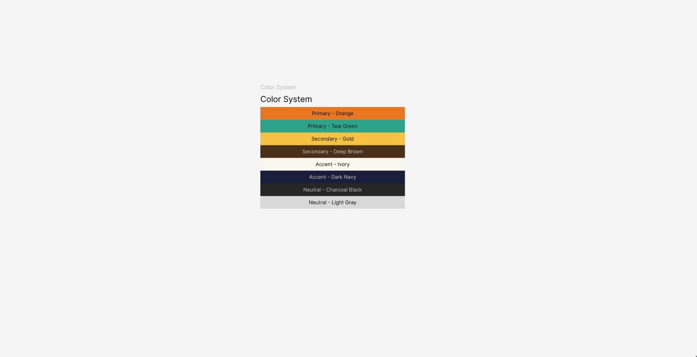

# Text Styles from CSV

**Text Styles from CSV** is a Figma plugin that imports typography styles from a CSV file, streamlining text style creation for a consistent design workflow. Upload a CSV, and the plugin generates text styles with the specified fonts, weights, sizes, letter spacing, and line heights.

 <!-- Add a demo GIF or screenshot -->

---

## 🚀 Features
- 📂 Import text styles directly from a CSV file with a simple upload process.
- 🔠 Supports font family, weight, size, letter spacing, and line height, ensuring precise typography control.
- 🎨 Automatically creates text styles in Figma, eliminating the need for manual input and reducing errors.
- ⚡ Saves time and ensures consistency across projects by standardizing text styles instantly.
- 🔄 Streamlines design workflows by making bulk text style updates fast and efficient.

---

## 📥 Installation
1. Download or clone this repository:
   ```sh
   git clone https://github.com/metagrati/text-styles-from-csv.git
   ```
2. Open Figma and navigate to **Plugins > Development > Import Plugin from Manifest**.
3. Select the `manifest.json` file from the cloned repository.

---

## 📌 How to Use
### 1️⃣ Run the Plugin
Open Figma, go to **Plugins > Text Styles from CSV**, and launch the plugin.

### 2️⃣ Upload Your CSV
- Click **"Upload CSV File"** and select your typography CSV.
- Ensure your CSV follows this format:

   | Element     | Font        | Size   | Weight   | Letter Spacing | Line Height |
   |------------|------------|--------|----------|----------------|-------------|
   | H1         | Montserrat | 80px   | ExtraBold| -1%            | 90px        |
   | Body Text  | Inter      | 16px   | Regular  | 0%             | 24px        |

   You can also refer to the [example.csv](example.csv) file for a sample format.

### 3️⃣ Generate Styles
- Click **"Import"**, and the plugin will automatically create the text styles in Figma.

---

## 🛠 Development

### **Requirements**
- Node.js (latest LTS version recommended)
- npm (included with Node.js)
- Figma Developer Mode enabled
### **Setup**
Ensure you have **Node.js** installed.

1. Install dependencies:
   ```sh
   npm install
   ```
2. Run the build script:
   ```sh
   npm run build
   ```
3. Load the plugin in Figma as a development plugin.

### **File Structure**
```
/text-styles-from-csv
├── ui.html              # Plugin UI
├── code.js              # Main Figma plugin logic
├── manifest.json        # Plugin manifest
├── package.json         # Dependencies
├── README.md            # Documentation
├── example.csv          # Example CSV file
└── assets/              # Icons, screenshots, etc.
```

---

## ⚡ Roadmap
- ✅ Import CSV support
- 🔄 CSV validation and error handling
- 🌍 Support for Google Fonts API
- 📦 Export Figma styles back to CSV

---

## 📝 License
This project is licensed under the **MIT License** – see the [LICENSE](LICENSE) file for details.

---

## 🤝 Contributing
Contributions are welcome! Feel free to open issues and pull requests.

---

## 📧 Contact
For feedback or support, reach out via **[ferdmanariel707@gmail.com](mailto:ferdmanariel707@gmail.com)**.

